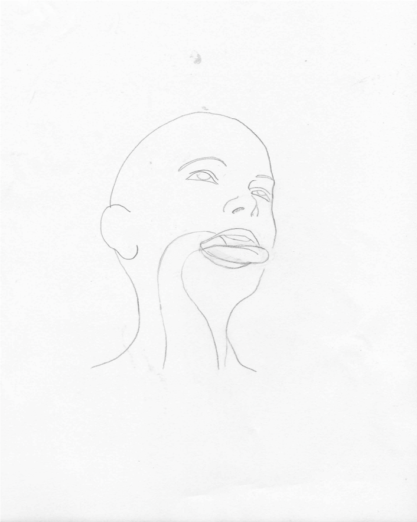
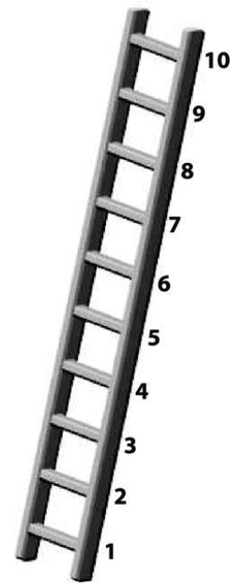

# REDCap module: Image Map


[](https://zenodo.org/badge/latestdoi/115049747)

This REDCap module replaces an input, radio, or checkbox field with an image that users can interact with to select one or more options. Specific applications include a body map (with over 70 body regions), a smile scale from 1-7 with facial expressions, three representations of teeth and teeth surfaces, among others. See below for a complete list of current imagemaps. The module is tied to questions via the `@IMAGEMAP` action tag and the name of one of the pre-defined image maps.  e.g. `@IMAGEMAP=CHOIRBODYMAP_FEMALE`.


## Prerequisites
- REDCap >= 12.0.4 (see previous released for support of earlier REDCap versions)

## Easy Installation
- Obtain this module from the Consortium [REDCap Repo](https://redcap.vanderbilt.edu/consortium/modules/index.php) from the control center.


## Manual Installation
- Clone this repo into `<redcap-root>/modules/imagemap_v0.0.0`.
- Go to **Control Center > External Modules** and enable Image Map.
- To activate this module for a particular project, go to the project home page, click on the **External Modules** link, and then enable Image Map for that project.

## Global Configuration

- **Use API endpoint for urls**: May need to be checked to allow module to work as expected in surveys.
  - You may or may not need this depending on your web server's configuration (determining which is beyond the scope of this document).


## Features included
This module defines a new action tag: `@IMAGEMAP`. The possible values for this tag are:


**`PAINMAP_MALE`**

<details>
<summary>Keys and Values for CHOIRBODYMAP_MALE</summary>
<p>

```
f01, Cranium (front-right) 
f02, Cranium (front-left)
f03, Face (front-right)
f04, Face (front-left)
f05, Neck (front-right)
f06, Neck (front-left)
f07, Shoulder (front-right)
f08, Chest (front-right)
f09, Chest (front-left)
f10, Shoulder (front-left)
f11, Bicep (front-right)
f12, Bicep (front-left)
f13, Elbow (front-right)
f14, Elbow (front-left)
f15, Forearm (front-right)
f16, Abdomen (front-right)
f17, Abdomen (front-left)
f18, Forearm (front-left)
f19, Wrist (front-right)
f20, Hip (front-right)
f21, Pubic (front-right)
f22, Pubic (front-left)
f23, Hip (front-left)
f24, Wrist (front-left)
f25, Hand (palm-right)
f26, Upper Leg (front-right)
f27, Upper Leg (front-left)
f28, Hand (palm-left)
f29, Knee (front-right)
f30, Knee (front-left)
f31, Lower Leg (front-right)
f32, Lower Leg (front-left)
f33, Ankle (front-right)
f34, Ankle (front-left)
f35, Foot (top-right)
f36, Foot (top-left)
b01, Cranium (back-left)
b02, Cranium (back-right)
b03, Head (back-left)
b04, Head (back-right)
b05, Neck (back-left)
b06, Neck (back-right)
b07, Shoulder (back-left)
b08, Upper Back (back-left)
b09, Upper Back (back-right)
b10, Shoulder (back-right)
b11, Bicep (back-left)
b12, Middle Back (back-left)
b13, Middle Back (back-right)
b14, Bicep (back-right)
b15, Elbow (back-left)
b16, Elbow (back-right)
b17, Forearm (back-left)
b18, Lower Back (back-left)
b19, Lower Back (back-right)
b20, Forearm (back-right)
b21, Wrist (back-left)
b22, Hip (back-left)
b23, Buttocks (back-left)
b24, Buttocks (back-right)
b25, Hip (back-right)
b26, Wrist (back-right)
b27, Hand (top-left)
b28, Upper Leg (back-left)
b29, Upper Leg (back-right)
b30, Hand (top-right)
b31, Knee (back-left)
b32, Knee (back-right)
b33, Lower Leg (back-left)
b34, Lower Leg (back-right)
b35, Ankle (back-left)
b36, Ankle (back-right)
b37, Foot (bottom-left)
b38, Foot (bottom-right)
```
</p>
</details>

Representation of a generic male body.  


**`PAINMAP_FEMALE`**

<details>
<summary>Keys and Values for CHOIRBODYMAP_FEMALE</summary>
<p>

```
f01, Cranium (front-right)
f02, Cranium (front-left)
f03, Face (front-right)
f04, Face (front-left)
f05, Neck (front-right)
f06, Neck (front-left)
f07, Shoulder (front-right)
f08, Chest (front-right)
f09, Chest (front-left)
f10, Shoulder (front-left)
f11, Bicep (front-right)
f12, Bicep (front-left)
f13, Elbow (front-right)
f14, Elbow (front-left)
f15, Forearm (front-right)
f16, Abdomen (front-right)
f17, Abdomen (front-left)
f18, Forearm (front-left)
f19, Wrist (front-right)
f20, Hip (front-right)
f21, Pubic (front-right)
f22, Pubic (front-left)
f23, Hip (front-left)
f24, Wrist (front-left)
f25, Hand (palm-right)
f26, Upper Leg (front-right)
f27, Upper Leg (front-left)
f28, Hand (palm-left)
f29, Knee (front-right)
f30, Knee (front-left)
f31, Lower Leg (front-right)
f32, Lower Leg (front-left)
f33, Ankle (front-right)
f34, Ankle (front-left)
f35, Foot (top-right)
f36, Foot (top-left)
b01, Cranium (back-left)
b02, Cranium (back-right)
b03, Head (back-left)
b04, Head (back-right)
b05, Neck (back-left)
b06, Neck (back-right)
b07, Shoulder (back-left)
b08, Upper Back (back-left)
b09, Upper Back (back-right)
b10, Shoulder (back-right)
b11, Bicep (back-left)
b12, Middle Back (back-left)
b13, Middle Back (back-right)
b14, Bicep (back-right)
b15, Elbow (back-left)
b16, Elbow (back-right)
b17, Forearm (back-left)
b18, Lower Back (back-left)
b19, Lower Back (back-right)
b20, Forearm (back-right)
b21, Wrist (back-left)
b22, Hip (back-left)
b23, Buttocks (back-left)
b24, Buttocks (back-right)
b25, Hip (back-right)
b26, Wrist (back-right)
b27, Hand (top-left)
b28, Upper Leg (back-left)
b29, Upper Leg (back-right)
b30, Hand (top-right)
b31, Knee (back-left)
b32, Knee (back-right)
b33, Lower Leg (back-left)
b34, Lower Leg (back-right)
b35, Ankle (back-left)
b36, Ankle (back-right)
b37, Foot (bottom-left)
b38, Foot (bottom-right)
```
</p>
</details>

Representation of a generic female body.  


**`SMILE_SCALE`**

<details>
<summary>Keys and Values for SMILE_SCALE</summary>
<p>

```
1, 1
2, 2
3, 3
4, 4
5, 5
6, 6
7, 7
```
</p>
</details>


**`5_FACE_PAINMAP`**

<details>
<summary>Keys and Values for 5_FACE_PAINMAP</summary>
<p>

```
1, 1
2, 2
3, 3
4, 4
5, 5
```
</p>
</details>


**`SINGLE_TOOTH`**

<details>
<summary>Keys and Values for SINGLE_TOOTH </summary>
<p>

```
1bucc, 1bucc
1ling, 1ling
1mesi, 1mesi
1dist, 1dist
1occl, 1occl
1root, 1root
```
</p>
</details>


**`TEETH_SURFACE`**

<details>
<summary>Keys and Values for TEETH_SURFACE </summary>
<p>

```
1r, 1r
1o, 1o
1l, 1l
1d, 1d
1m, 1m
1b, 1b
2r, 2r
2o, 2o
2l, 2l
2d, 2d
2m, 2m
2b, 2b
3r, 3r
3o, 3o
3l, 3l
3d, 3d
3m, 3m
3b, 3b
4r, 4r
4o, 4o
4l, 4l
4d, 4d
4m, 4m
4b, 4b
5r, 5r
5o, 5o
5l, 5l
5d, 5d
5m, 5m
5b, 5b
6r, 6r
6o, 6o
6l, 6l
6d, 6d
6m, 6m
6b, 6b
7r, 7r
7o, 7o
7l, 7l
7d, 7d
7m, 7m
7b, 7b
8r, 8r
8o, 8o
8l, 8l
8d, 8d
8m, 8m
8b, 8b
9r, 9r
9o, 9o
9l, 9l
9d, 9d
9m, 9m
9b, 9b
10r, 10r
10o, 10o
10l, 10l
10d, 10d
10m, 10m
10b, 10b
11r, 11r
11o, 11o
11l, 11l
11d, 11d
11m, 11m
11b, 11b
12r, 12r
12o, 12o
12l, 12l
12d, 12d
12m, 12m
12b, 12b
13r, 13r
13o, 13o
13l, 13l
13d, 13d
13m, 13m
13b, 13b
14r, 14r
14o, 14o
14l, 14l
14d, 14d
14m, 14m
14b, 14b
15r, 15r
15o, 15o
15l, 15l
15d, 15d
15m, 15m
15b, 15b
16r, 16r
16o, 16o
16l, 16l
16d, 16d
16m, 16m
16b, 16b
ar, ar
ao, ao
al, al
ad, ad
am, am
ab, ab
br, br
bo, bo
bl, bl
bd, bd
bm, bm
bb, bb
cr, cr
co, co
cl, cl
cd, cd
cm, cm
cb, cb
dr, dr
do, do
dl, dl
dd, dd
dm, dm
db, db
er, er
eo, eo
el, el
ed, ed
em, em
eb, eb
fr, fr
fo, fo
fl, fl
fd, fd
fm, fm
fb, fb
gr, gr
go, go
gl, gl
gd, gd
gm, gm
gb, gb
hr, hr
ho, ho
hl, hl
hd, hd
hm, hm
hb, hb
ir, ir
io, io
il, il
id, id
im, im
ib, ib
jr, jr
jo, jo
jl, jl
jd, jd
jm, jm
jb, jb
tr, tr
to, to
tl, tl
td, td
tm, tm
tb, tb
sr, sr
so, so
sl, sl
sd, sd
sm, sm
sb, sb
rr, rr
ro, ro
rl, rl
rd, rd
rm, rm
rb, rb
qr, qr
qo, qo
ql, ql
qd, qd
qm, qm
qb, qb
pr, pr
po, po
pl, pl
pd, pd
pm, pm
pb, pb
or, or
oo, oo
ol, ol
od, od
om, om
ob, ob
nr, nr
no, no
nl, nl
nd, nd
nm, nm
nb, nb
mr, mr
mo, mo
ml, ml
md, md
mm, mm
mb, mb
lr, lr
lo, lo
ll, ll
ld, ld
lm, lm
lb, lb
kr, kr
ko, ko
kl, kl
kd, kd
km, km
kb, kb

```
</p>
</details>


**`TEETH`**

<details>
<summary>Keys and Values for TEETH</summary>
<p>

```
1, 1
2, 2
3, 3
4, 4
5, 5
6, 6
7, 7
8, 8
9, 9
10, 10
11, 11
12, 12
13, 13
14, 14
15, 15
16, 16
17, 17
18, 18
19, 19
20, 20
21, 21
22, 22
23, 23
24, 24
25, 25
26, 26
27, 27
28, 28
29, 29
30, 30
31, 31
32, 32
```
</p>
</details>


**`PI-RADS`**

<details>
<summary>Keys and Values for PI-RADS</summary>
<p>

```
1, 1
2, 2
3, 3
4, 4
5, 5
6, 6
7, 7
8, 8
9, 9
10, 10
11, 11
12, 12
13, 13
14, 14
15, 15
16, 16
17, 17
18, 18
19, 19
20, 20
21, 21
22, 22
23, 23
24, 24
25, 25
26, 26
27, 27
28, 28
29, 29
30, 30
```
</p>
</details>


**`PI-RADS_V2-1`**

<details>
<summary>Keys and Values for PI-RADS_v2-1</summary>
<p>

```
1, Right seminal vesicles
2, Left seminal vesicles
3, Right anterior fibromuscular stroma base
4, Left anterior fibromuscular stroma base
5, Right anterior peripheral zone base
6, Left anterior peripheral zone base
7, Right anterior transition zone base
8, Left anterior transition zone base
9, Right lateral posterior peripheral zone base
10, Left lateral posterior peripheral zone base
11, Right posterior reansition zone base
12, Left posterior transition zone base
13, Right centeral zone base
14, Left central zone base
15, Right medial posterior peripheral zone base
16, Left medial posterior peripheral zone base
17, Right anterior fibromuscular stroma mid
18, Left anterior fibromuscular stroma mid
19, Right anterior peripheral zone mid
20, Left anterior peripheral zone mid
21, Right anterior transition zone mid
22, Left anterior transition zone mid
23, Right lateral posterior peripheral zone mid
24, Left lateral posterior peripheral zone mid
25, Right posterior transition zone mid
26, Left posterior transition zone mid
27, Right medial posterior peripheral zone mid
28, Left medial posterior peripheral zone mid
29, Right anterior fibromuscular stroma apex
30, Left anterior fibromuscular stroma apex
31, Right anterior peripheral zone apex
32, Left anterior peripheral zone apex
33, Right anterior transition zone apex
34, Left anterior transition zone apex
35, Right lateral posterior peripheral zone apex
36, Left lateral posterior peripheral zone apex
37, Right medial posterior peripheral zone apex
38, Left medial posterior peripheral zone apex
39, Right posterior transtion zone apex
40, Left posterior transtion zone apex
41, External urethral sphincter
```
</p>
</details>


**`RHEUMATOID_MAN`**

<details>
<summary>Keys and Values for RHEUMATOID_MAN</summary>
<p>

```
f01, Left Temporomandibular
f02, Right Temporomandibular
f03, Left Sternoclavicular
f04, Right Sternoclavicular
f05, Left Acromioclavicular
f06, Right Acromioclavicular
f07, Left Shoulder
f08, Right Shoulder
f09, Left Elbow
f10, Right Elbow
f11, Left Wrist
f12, Right Wrist
f13, Left Thumb Carpometacarpal
f14, Right Thumb Carpometacarpal
f15, Left Thumb Metacarpal
f16, Right Thumb Metacarpal
f17, Left Thumb Interphalangeal
f18, Right Thumb Interphalangeal
f19, Left Index MCP
f20, Left Index PIP
f21, Left Index DIP
f22, Left Middle MCP
f23, Left Middle PIP
f24, Left Middle DIP
f25, Left Ring MCP
f26, Left Ring PIP
f27, Left Ring DIP
f28, Left Pinky MCP
f29, Left Pinky PIP
f30, Left Pinky DIP
f31, Right Index MCP
f32, Right Index PIP
f33, Right Index DIP
f34, Right Middle MCP
f35, Right Middle PIP
f36, Right Middle DIP
f37, Right Ring MCP
f38, Right Ring PIP
f39, Right Ring DIP
f40, Right Pinky MCP
f41, Right Pinky PIP
f42, Right Pinky DIP
f43, Left Hip
f44, Right Hip
f45, Left Knee
f46, Right Knee
f47, Left Hallux MTP
f48, Left Hallux PIP
f49, Left Index Toe MTP
f50, Left Index Toe PIP
f51, Left Middle Toe MTP
f52, Left Middle Toe PIP
f53, Left Ring Toe MTP
f54, Left Ring Toe PIP
f55, Left Pinky Toe MTP
f56, Left Pinky Toe PIP
f57, Right Hallux MTP
f58, Right Hallux PIP
f59, Right Index Toe MTP
f60, Right Index Toe PIP
f61, Right Middle Toe MTP
f62, Right Middle Toe PIP
f63, Right Ring Toe MTP
f64, Right Ring Toe PIP
f65, Right Pinky Toe MTP
f66, Right Pinky Toe PIP
f67, Cervical Spine
f68, Thoracic Spine
f69, Lumbar Spine
f70, Left Sacroiliac
f71, Right Sacroiliac
f72, Left Ankle
f73, Right Ankle
f74, Left Talonavicular
f75, Right Talonavicular
f76, Left Tarsometatarsal
f77, Right Tarsometatarsal
```
</p>
</details>

The Rheumatoid man imagemap tool reflects disease activity and progression by recording joint involvement. It was designed for use in paediatric rheumatology, but can be used wherever joint mapping is required.  The Rheumatoid man is in anatomical position, which means a frontal depiction, but not mirrored, i.e., the left hand would be depicted on the right side of the screen.  


**`VA_CHART`**

<details>
<summary>Keys and Values for VA_CHART</summary>
<p>

```
p1, 0, 0
p2, -0.05, -0.05
p3, 0.05, -0.05
p4, 0.05, 0.05
p5, -0.05, 0.05
p6, -0.15, 0.05
p7, -0.15, -0.05
p8, -0.15, -0.15
p9, -0.05, -0.15
p10, 0.05, -0.15
p11, 0.15, -0.15
p12, 0.15, -0.05
p13, 0.15, 0.05
p14, 0.15, 0.15
p15, 0.05, 0.15
p16, -0.05, 0.15
p17, -0.15, 0.15
p18, -0.25, 0.15
p19, -0.25, 0.05
p20, -0.25, -0.05
p21, -0.25, -0.15
p22, -0.25, -0.15
p23, -0.15, -0.25
p24, -0.05, -0.25
p25, 0.05, -0.25
p26, 0.15, -0.25
p27, 0.25, -0.25
p28, 0.25, -0.15
p29, 0.25, -0.05
p30, 0.25, 0.05
p31, 0.25, 0.15
p32, 0.25, 0.25
p33, 0.15, 0.25
p34, 0.05, 0.25
p35, -0.05, 0.25
p36, -0.15, 0.25
p37, -0.25, 0.25
p38, -0.35, 0.25
p39, -0.35, 0.15
p40, -0.35, 0.05
p41, -0.35, -0.05
p42, -0.35, -0.15
p43, -0.35, -0.25
p44, -0.35, -0.35
p45, -0.25, -0.35
p46, -0.15, -0.35
p47, -0.05, -0.35
p48, 0.05, -0.35
p49, 0.15, -0.35
p50, 0.25, -0.35
p51, 0.35, -0.35
p52, 0.35, -0.25
p53, 0.35, -0.15
p54, 0.35, -0.05
p55, 0.35, 0.05
p56, 0.35, 0.15
p57, 0.35, 0.25
p58, 0.35, 0.35
p59, 0.25, 0.35
p60, 0.15, 0.35
p61, 0.05, 0.35
p62, -0.05, 0.35
p63, -0.15, 0.35
p64, -0.25, 0.35
p65, -0.35, 0.35
p66, -0.45, 0.35
p67, -0.45, 0.25
p68, -0.45, 0.15
p69, -0.45, 0.05
p70, -0.45, -0.05
p71, -0.45, -0.15
p72, -0.45, -0.25
p73, -0.45, -0.35
p74, -0.45, -0.45
p75, -0.35, -0.45
p76, -0.25, -0.45
p77, -0.15, -0.45
p78, -0.05, -0.45
p79, 0.05, -0.45
p80, 0.15, -0.45
p81, 0.25, -0.45
p82, 0.35, -0.45
p83, 0.45, -0.45
p84, 0.45, -0.35
p85, 0.45, -0.25
p86, 0.45, -0.15
p87, 0.45, -0.05
p88, 0.45, 0.05
p89, 0.45, 0.15
p90, 0.45, 0.25
p91, 0.45, 0.35
p92, 0.45, 0.45
p93, 0.35, 0.45
p94, 0.25, 0.45
p95, 0.15, 0.45
p96, 0.05, 0.45
p97, -0.05, 0.45
p98, -0.15, 0.45
p99, -0.25, 0.45
p100, -0.35, 0.45
p101, -0.45, 0.45
p102, -0.55, 0.45
p103, -0.55, 0.35
p104, -0.55, 0.25
p105, -0.55, 0.15
p106, -0.55, 0.05
p107, -0.55, -0.05
p108, -0.55, -0.15
p109, -0.55, -0.25
p110, -0.55, -0.35
p111, -0.55, -0.45
p112, -0.55, -0.55
p113, -0.45, -0.55
p114, -0.35, -0.55
p115, -0.25, -0.55
p116, -0.15, -0.55
p117, -0.05, -0.55
p118, 0.05, -0.55
p119, 0.15, -0.55
p120, 0.25, -0.55
p121, 0.35, -0.55
p122, 0.45, -0.55
p123, 0.55, -0.55
p124, 0.55, -0.45
p125, 0.55, -0.35
p126, 0.55, -0.25
p127, 0.55, -0.15
p128, 0.55, -0.05
p129, 0.55, 0.05
p130, 0.55, 0.15
p131, 0.55, 0.25
p132, 0.55, 0.35
p133, 0.55, 0.45
p134, 0.55, 0.55
p135, 0.45, 0.55
p136, 0.35, 0.55
p137, 0.25, 0.55
p138, 0.15, 0.55
p139, 0.05, 0.55
p140, -0.05, 0.55
p141, -0.15, 0.55
p142, -0.25, 0.55
p143, -0.35, 0.55
p144, -0.45, 0.55
p145, -0.55, 0.55
p146, -0.65, 0.55
p147, -0.65, 0.45
p148, -0.65, 0.35
p149, -0.65, 0.25
p150, -0.65, 0.15
p151, -0.65, 0.05
p152, -0.65, -0.05
p153, -0.65, -0.15
p154, -0.65, -0.25
p155, -0.65, -0.35
p156, -0.65, -0.45
p157, -0.65, -0.55
p158, -0.65, -0.65
p159, -0.55, -0.65
p160, -0.45, -0.65
p161, -0.35, -0.65
p162, -0.25, -0.65
p163, -0.15, -0.65
p164, -0.05, -0.65
p165, 0.05, -0.65
p166, 0.15, -0.65
p167, 0.25, -0.65
p168, 0.35, -0.65
p169, 0.45, -0.65
p170, 0.55, -0.65
p171, 0.65, -0.65
p172, 0.65, -0.55
p173, 0.65, -0.45
p174, 0.65, -0.35
p175, 0.65, -0.25
p176, 0.65, -0.15
p177, 0.65, -0.05
p178, 0.65, 0.05
p179, 0.65, 0.15
p180, 0.65, 0.25
p181, 0.65, 0.35
p182, 0.65, 0.45
p183, 0.65, 0.55
p184, 0.65, 0.65
p185, 0.55, 0.65
p186, 0.45, 0.65
p187, 0.35, 0.65
p188, 0.25, 0.65
p189, 0.15, 0.65
p190, 0.05, 0.65
p191, -0.05, 0.65
p192, -0.15, 0.65
p193, -0.25, 0.65
p194, -0.35, 0.65
p195, -0.45, 0.65
p196, -0.55, 0.65
p197, -0.65, 0.65
p198, -0.75, 0.65
p199, -0.75, 0.55
p200, -0.75, 0.45
p201, -0.75, 0.35
p202, -0.75, 0.25
p203, -0.75, 0.15
p204, -0.75, 0.05
p205, -0.75, -0.05
p206, -0.75, -0.15
p207, -0.75, -0.25
p208, -0.75, -0.35
p209, -0.75, -0.45
p210, -0.75, -0.55
p211, -0.75, -0.65
p212, -0.75, -0.75
p213, -0.65, -0.75
p214, -0.55, -0.75
p215, -0.45, -0.75
p216, -0.35, -0.75
p217, -0.25, -0.75
p218, -0.15, -0.75
p219, -0.05, -0.75
p220, 0.05, -0.75
p221, 0.15, -0.75
p222, 0.25, -0.75
p223, 0.35, -0.75
p224, 0.45, -0.75
p225, 0.55, -0.75
p226, 0.65, -0.75
p227, 0.75, -0.75
p228, 0.75, -0.65
p229, 0.75, -0.55
p230, 0.75, -0.45
p231, 0.75, -0.35
p232, 0.75, -0.25
p233, 0.75, -0.15
p234, 0.75, -0.05
p235, 0.75, 0.05 
p236, 0.75, 0.15
p237, 0.75, 0.25
p238, 0.75, 0.35
p239, 0.75, 0.45
p240, 0.75, 0.55
p241, 0.75, 0.65
p242, 0.75, 0.75
p243, 0.65, 0.75
p244, 0.55, 0.75
p245, 0.45, 0.75
p246, 0.35, 0.75
p247, 0.25, 0.75
p248, 0.15, 0.75
p249, 0.05, 0.75
p250, -0.05, 0.75
p251, -0.15, 0.75
p252, -0.25, 0.75
p253, -0.35, 0.75
p254, -0.45, 0.75
p255, -0.55, 0.75
p256, -0.65, 0.75
p257, -0.75, 0.75
p258, -0.85, 0.75
p259, -0.85, 0.65
p260, -0.85, 0.55
p261, -0.85, 0.45
p262, -0.85, 0.35
p263, -0.85, 0.25
p264, -0.85, 0.15
p265, -0.85, 0.05
p266, -0.85, -0.05
p267, -0.85, -0.15
p268, -0.85, -0.25
p269, -0.85, -0.35
p270, -0.85, -0.45
p271, -0.85, -0.55
p272, -0.85, -0.65
p273, -0.85, -0.75
p274, -0.85, -0.85
p275, -0.75, -0.85
p276, -0.65, -0.85
p277, -0.55, -0.85
p278, -0.45, -0.85
p279, -0.35, -0.85
p280, -0.25, -0.85
p281, -0.15, -0.85
p282, -0.05, -0.85
p283, 0.05, -0.85
p284, 0.15, -0.85
p285, 0.25, -0.85
p286, 0.35, -0.85
p287, 0.45, -0.85
p288, 0.55, -0.85
p289, 0.65, -0.85
p290, 0.75, -0.85
p291, 0.85, -0.85
p292, 0.85, -0.75
p293, 0.85, -0.65
p294, 0.85, -0.55
p295, 0.85, -0.45
p296, 0.85, -0.35
p297, 0.85, -0.25
p298, 0.85, -0.15
p299, 0.85, -0.05
p300, 0.85, 0.05
p301, 0.85, 0.15
p302, 0.85, 0.25
p303, 0.85, 0.35
p304, 0.85, 0.45
p305, 0.85, 0.55
p306, 0.85, 0.65
p307, 0.85, 0.75
p308, 0.85, 0.85
p309, 0.75, 0.85
p310, 0.65, 0.85
p311, 0.55, 0.85
p312, 0.45, 0.85
p313, 0.35, 0.85
p314, 0.25, 0.85
p315, 0.15, 0.85
p316, 0.05, 0.85
p317, -0.05, 0.85
p318, -0.15, 0.85
p319, -0.25, 0.85
p320, -0.35, 0.85
p321, -0.45, 0.85
p322, -0.55, 0.85
p323, -0.65, 0.85
p324, -0.75, 0.85
p325, -0.85, 0.85
p326, -0.95, 0.85
p327, -0.95, 0.75
p328, -0.95, 0.65
p329, -0.95, 0.55
p330, -0.95, 0.45
p331, -0.95, 0.35
p332, -0.95, 0.25
p333, -0.95, 0.15
p334, -0.95, 0.05
p335, -0.95, -0.05
p336, -0.95, -0.15
p337, -0.95, -0.25
p338, -0.95, -0.35
p339, -0.95, -0.45
p340, -0.95, -0.55
p341, -0.95, -0.65
p342, -0.95, -0.75
p343, -0.95, -0.85
p344, -0.95, -0.95
p345, -0.85, -0.95
p346, -0.75, -0.95
p347, -0.65, -0.95
p348, -0.55, -0.95
p349, -0.45, -0.95
p350, -0.35, -0.95
p351, -0.25, -0.95
p352, -0.15, -0.95
p353, -0.05, -0.95
p354, 0.05, -0.95
p355, 0.15, -0.95
p356, 0.25, -0.95
p357, 0.35, -0.95
p358, 0.45, -0.95
p359, 0.55, -0.95
p360, 0.65, -0.95
p361, 0.75, -0.95
p362, 0.85, -0.95
p363, 0.95, -0.95
p364, 0.95, -0.85
p365, 0.95, -0.75
p366, 0.95, -0.65
p367, 0.95, -0.55
p368, 0.95, -0.45
p369, 0.95, -0.35
p370, 0.95, -0.25
p371, 0.95, -0.15
p372, 0.95, -0.05
p373, 0.95, 0.05
p374, 0.95, 0.15
p375, 0.95, 0.25
p376, 0.95, 0.35
p377, 0.95, 0.45
p378, 0.95, 0.55
p379, 0.95, 0.65
p380, 0.95, 0.75
p381, 0.95, 0.85
p382, 0.95, 0.95
p383, 0.85, 0.95
p384, 0.75, 0.95
p385, 0.65, 0.95
p386, 0.55, 0.95
p387, 0.45, 0.95
p388, 0.35, 0.95
p389, 0.25, 0.95
p390, 0.15, 0.95
p391, 0.05, 0.95
p392, -0.05, 0.95
p393, -0.15, 0.95
p394, -0.25, 0.95
p395, -0.35, 0.95
p396, -0.45, 0.95
p397, -0.55, 0.95
p398, -0.65, 0.95
p399, -0.75, 0.95
p400, -0.85, 0.95
p401, -0.95, 0.95
```
</p>
</details>

A 2-D emotion wheel representation of the circumplex model of affect.  


**`MBODY`**

<details>
<summary>Keys and Values for MBODY</summary>
<p>

```
1, 1
2, 2
3, 3
4, 4
5, 5
6, 6
7, 7
8, 8
9, 9
10, 10
11, 11
12, 12
13, 13
14, 14
15, 15
16, 16
17, 17
18, 18
19, 19
20, 20
21, 21
22, 22
23, 23
24, 24
25, 25
26, 26
27, 27
28, 28
29, 29
30, 30
31, 31
32, 32
33, 33
34, 34
35, 35
```
</p>
</details>

Michigan Body Map (MBM) reflects body areas where chronic pain may be experienced.  


**`BEES (BONUS)`**

<details>
<summary>Keys and Values for BEES</summary>
<p>

```
1, 1
2, 2
3, 3
4, 4
5, 5
6, 6
7, 7
8, 8
9, 9
10, 10
```
</p>
</details>


**`DO_TOUCH_NET_BODY_COLOUR`** and **`DO_TOUCH_NET_BODY_GREY`**

<details>
<summary>Keys and Values for DO_TOUCH_NET</summary>
<p>

```
01, Face (Front)
02, Head (Front)
03, Neck (Front)
04, Chest-Ribs (Front)
05, Shoulder (Front Right)
06, Shoulder (Front Left)
07, Upper Arm (Front Right)
08, Upper Arm (Front Left)
09, Elbow (Front Right)
10, Elbow (Front Left)
11, Forearm (Front Right)
12, Forearm (Front Left)
13, Wrist (Front Right)
14, Wrist (Front Left)
15, Hand (Front Right)
16, Hand (Front Left)
17, Abdomen (Front)
18, Hips-Pelvis (Front)
19, Thigh (Front Right)
20, Thigh (Front Left)
21, Knee (Front Right)
22, Knee (Front Left)
23, Shin-Calf (Front Right)
24, Shin-Calf (Front Left)
25, Ankle (Front Right)
26, Ankle (Front Left)
27, Foot (Front Right)
28, Foot (Front Left)
29, Head (Back)
30, Neck (Back)
31, Shoulder (Back Left)
32, Shoulder (Back Right)
33, Ribs (Back Left)
34, Ribs (Back Right)
35, Upper Back (Back)
36, Upper Arm (Back Left)
37, Upper Arm (Back Right)
38, Elbow (Back Left)
39, Elbow (Back Right)
40, Forearm (Back Left)
41, Forearm (Back Right)
42, Wrist (Back Left)
43, Wrist (Back Right)
44, Hand (Back Left)
45, Hand (Back Right)
46, Lower Back (Back)
47, Hip-Pelvis (Back Left)
48, Hip-Pelvis (Back Right)
49, Tailbone-Sacrum (Back)
50, Thigh (Back Left)
51, Thigh (Back Right)
52, Knee (Back Left)
53, Knee (Back Right)
54, Shin-Calf (Back Left)
55, Shin-Calf (Back Right)
56, Ankle (Back Left)
57, Ankle (Back Right)
58, Foot (Back Left)
59, Foot (Back Right)
```
</p>
</details>

DO-Touch.NET body region image map designed for use in osteopathic manipulative medicine (OMM) research.


**`66SWOLLEN_68TENDER_JOINT_COUNT`**

<details>
<summary>Keys and Values for 66SWOLLEN_68TENDER_JOINT_COUNT</summary>
<p>

```
tmj_r_swln, Right Temporomandibular Swollen
tmj_l_swln, Left Temporomandibular Swollen
acj_r_swln, Right Acromioclavicular Swollen
scj_r_swln, Right Sternoclavicular Swollen
scj_l_swln, Left Sternoclavicular Swollen
acj_l_swln, Left Acromioclavicular Swollen
shldr_r_swln, Right Shoulder Swollen
shldr_l_swln, Left Shoulder Swollen
elbw_r_swln, Right Elbow Swollen
elbw_l_swln, Left Elbow Swollen
wrst_r_swln, Right Wrist Swollen
wrst_l_swln, Left Wrist Swollen
thmb_mcp1_r_swln, Right Thumb MCP Swollen
thmb_mcp1_l_swln, Left Thumb MCP Swollen
thmb_pip1_r_swln, Right Thumb PIP Swollen
thmb_pip1_l_swln, Left Thumb PIP Swollen
fngr_mcp5_r_swln, Right Pinky/Little Finger MCP Swollen
fngr_mcp4_r_swln, Right Ring Finger MCP Swollen
fngr_mcp3_r_swln, Right Middle Finger MCP Swollen
fngr_mcp2_r_swln, Right Index Finger MCP Swollen
fngr_mcp2_l_swln, Left Index Finger MCP Swollen
fngr_mcp3_l_swln, Left Middle Finger MCP Swollen
fngr_mcp4_l_swln, Left Ring Finger MCP Swollen
fngr_mcp5_l_swln, Left Pinky/Little Finger MCP Swollen
fngr_pip5_r_swln, Right Pinky/Little Finger PIP Swollen
fngr_pip4_r_swln, Right Ring Finger PIP Swollen
fngr_pip3_r_swln, Right Middle Finger PIP Swollen
fngr_pip2_r_swln, Right Index Finger PIP Swollen
fngr_pip2_l_swln, Left Index Finger PIP Swollen
fngr_pip3_l_swln, Left Middle Finger PIP Swollen
fngr_pip4_l_swln, Left Ring Finger PIP Swollen
fngr_pip5_l_swln, Left Pinky/Little Finger PIP Swollen
fngr_dip5_r_swln, Right Pinky/Little Finger DIP Swollen
fngr_dip4_r_swln, Right Ring Finger DIP Swollen
fngr_dip3_r_swln, Right Middle Finger DIP Swollen
fngr_dip2_r_swln, Right Index Finger DIP Swollen
fngr_dip2_l_swln, Left Index Finger DIP Swollen
fngr_dip3_l_swln, Left Middle Finger DIP Swollen
fngr_dip4_l_swln, Left Ring Finger DIP Swollen
fngr_dip5_l_swln, Left Pinky/Little Finger DIP Swollen
knee_r_swln, Right Knee Swollen
knee_l_swln, Left Knee Swollen
ankle_r_swln, Right Ankle Swollen
ankle_l_swln, Left Ankle Swollen
midfoot_r_swln, Right Midfoot/tarsus Swollen
midfoot_l_swln, Left Midfoot/tarsus Swollen
toe_mtp5_r_swln, Right Pinky/Little Toe MTP Swollen
toe_mtp4_r_swln, Right Ring Toe MTP Swollen
toe_mtp3_r_swln, Right Middle Toe MTP Swollen
toe_mtp2_r_swln, Right Index Toe MTP Swollen
toe_mtp1_r_swln, Right Big Toe MTP Swollen
toe_mtp1_l_swln, Left Big Toe MTP Swollen
toe_mtp2_l_swln, Left Index Toe MTP Swollen
toe_mtp3_l_swln, Left Middle Toe MTP Swollen
toe_mtp4_l_swln, Left Ring Toe MTP Swollen
toe_mtp5_l_swln, Left Pinky/Little Toe MTP Swollen
toe_pip5_r_swln, Right Pinky/Little Toe PIP Swollen
toe_pip4_r_swln, Right Ring Toe PIP Swollen
toe_pip3_r_swln, Right Middle Toe PIP Swollen
toe_pip2_r_swln, Right Index Toe PIP Swollen
toe_pip1_r_swln, Right Big Toe PIP Swollen
toe_pip1_l_swln, Left Big Toe PIP Swollen
toe_pip2_l_swln, Left Index Toe PIP Swollen
toe_pip3_l_swln, Left Middle Toe PIP Swollen
toe_pip4_l_swln, Left Ring Toe PIP Swollen
toe_pip5_l_swln, Left Pinky/Little Toe PIP Swollen
tmj_r_tndr, Right Temporomandibular Tender
tmj_l_tndr, Left Temporomandibular Tender
acj_r_tndr, Right Acromioclavicular Tender
scj_r_tndr, Right Sternoclavicular Tender
scj_l_tndr, Left Sternoclavicular Tender
acj_l_tndr, Left Acromioclavicular Tender
shldr_r_tndr, Right Shoulder Tender
shldr_l_tndr, Left Shoulder Tender
elbw_r_tndr, Right Elbow Tender
elbw_l_tndr, Left Elbow Tender
hip_r_tndr, Right Hip Tender
hip_l_tndr, Left Hip Tender
wrist_r_tndr, Right Wrist Tender
wrist_l_tndr, Left Wrist Tender
thmb_mcp1_r_tndr, Right Thumb MCP Tender
thmb_mcp1_l_tndr, Left Thumb MCP Tender
thmb_pip1_r_tndr, Right Thumb PIP Tender
thmb_pip1_l_tndr, Left Thumb PIP Tender
fngr_mcp5_r_tndr, Right Pinky/Little Finger MCP Tender
fngr_mcp4_r_tndr, Right Ring Finger MCP Tender
fngr_mcp3_r_tndr, Right Middle Finger MCP Tender
fngr_mcp2_r_tndr, Right Index Finger MCP Tender
fngr_mcp2_l_tndr, Left Index Finger MCP Tender
fngr_mcp3_l_tndr, Left Middle Finger MCP Tender
fngr_mcp4_l_tndr, Left Ring Finger MCP Tender
fngr_mcp5_l_tndr, Left Pinky/Little Finger MCP Tender
fngr_pip5_r_tndr, Right Pinky/Little Finger PIP Tender
fngr_pip4_r_tndr, Right Ring Finger PIP Tender
fngr_pip3_r_tndr, Right Middle Finger PIP Tender
fngr_pip2_r_tndr, Right Index Finger PIP Tender
fngr_pip2_l_tndr, Left Index Finger PIP Tender
fngr_pip3_l_tndr, Left Middle Finger PIP Tender
fngr_pip4_l_tndr, Left Ring Finger PIP Tender
fngr_pip5_l_tndr, Left Pinky/Little Finger PIP Tender
fngr_dip5_r_tndr, Right Pinky/Little Finger DIP Tender
fngr_dip4_r_tndr, Right Ring Finger DIP Tender
fngr_dip3_r_tndr, Right Middle Finger DIP Tender
fngr_dip2_r_tndr, Right Index Finger DIP Tender
fngr_dip2_l_tndr, Left Index Finger DIP Tender
fngr_dip3_l_tndr, Left Middle Finger DIP Tender
fngr_dip4_l_tndr, Left Ring Finger DIP Tender
fngr_dip5_l_tndr, Left Pinky/Little Finger DIP Tender
knee_r_tndr, Right Knee Tender
knee_l_tndr, Left Knee Tender
ankle_r_tndr, Right Ankle Tender
ankle_l_tndr, Left Ankle Tender
midfoot_r_tndr, Right Midfoot/tarsus Tender
midfoot_l_tndr, Left Midfoot/tarsus Tender
toe_mtp5_r_tndr, Right Pinky/Little Toe MTP Tender
toe_mtp4_r_tndr, Right Ring Toe MTP Tender
toe_mtp3_r_tndr, Right Middle Toe MTP Tender
toe_mtp2_r_tndr, Right Index Toe MTP Tender
toe_mtp1_r_tndr, Right Big Toe MTP Tender
toe_mtp1_l_tndr, Left Big Toe MTP Tender
toe_mtp2_l_tndr, Left Index Toe MTP Tender
toe_mtp3_l_tndr, Left Middle Toe MTP Tender
toe_mtp4_l_tndr, Left Ring Toe MTP Tender
toe_mtp5_l_tndr, Left Pinky/Little Toe MTP Tender
toe_pip5_r_tndr, Right Pinky/Little Toe PIP Tender
toe_pip4_r_tndr, Right Ring Toe PIP Tender
toe_pip3_r_tndr, Right Middle Toe PIP Tender
toe_pip2_r_tndr, Right Index Toe PIP Tender
toe_pip1_r_tndr, Right Big Toe PIP Tender
toe_pip1_l_tndr, Left Big Toe PIP Tender
toe_pip2_l_tndr, Left Index Toe PIP Tender
toe_pip3_l_tndr, Left Middle Toe PIP Tender
toe_pip4_l_tndr, Left Ring Toe PIP Tender
toe_pip5_l_tndr, Left Pinky/Little Toe PIP Tender
nil_tndrorswln_joints, No tender or swollen joints
```
</p>
</details>

The 66 Swollen / 68 Tender Joint Count can be used to record the number of tender and swollen joints in patients with inflammatory arthritis e.g. psoriatic arthritis, rheumatoid arthritis. These counts can be used in calculated fields to generate disease activity scores in combination with other variables e.g. DAPSA, DAS28 scores.


**`FR_REGION`**

<details>
<summary>Keys and Values for FR_REGION</summary>
<p>

```
1,GUADELOUPE
2,MARTINIQUE
3,GUYANE
4,LA REUNION
6,MAYOTTE
11,ILE DE FRANCE
24,CENTRE VAL DE LOIRE
27,BOURGOGNE FRANCHE COMTE
28,NORMANDIE
32,HAUTS DE FRANCE
44,GRAND EST
52,PAYS DE LA LOIRE
53,BRETAGNE
75,NOUVELLE AQUITAINE
76,OCCITANIE
84,AUVERGNE RHONE ALPES
93,PROVENCE ALPES COTE D AZUR
94,CORSE
```
</p>
</details>

French Region 2020 : to localize in one click a region - Région Française 2020 : Pour localiser en un clic une région.


**`FIBROMYALGIA_BODY`**

<details>
<summary>Keys and Values for FIBROMYALGIA_BODY</summary>
<p>

```
01, Right jaw
02, Left jaw
03, Neck
04, Right Shoulder
05, Left Shoulder
06, Chest or breast
07, Upper back
08, Right upper arm
09, Left upper arm
10, Abdomen
11, Lower back
12, Right lower arm
13, Left lower arm
14, Right hip or buttocks
15, Left hip or buttocks
16, Right upper leg
17, Left upper leg
18, Right lower leg
19, Left lower leg
```
</p>
</details>

This is a Patient self-report figure for the Assessment of Fibromyalgia.


**`DERM_PHOTO_BODY`**

<details>
<summary>Keys and Values for DERM_PHOTO_BODY</summary>
<p>

```
f01, Face
f02, Chest
f03, Right Arm
f04, Left Arm
f05, Right Leg
f06, Left Leg
r02, Back
```
</p>
</details>

This is a body rendering developed at Stanford for a specific project -- no attributions required.


**`SZMN_FRONT`**

<details>
<summary>Keys and Values for SZMN_FRONT</summary>
<p>

```
01, Left Eye
02, Right Eye
03, Nose
04, Mouth
05, Left Jaw
06, Right Jaw
07, Voicebox
08, Throat
09, Left Cheek
10, Right Cheek
11, Left Temple
12, Right Temple
13, Left Ear
14, Right Ear
15, Head
```
</p>
</details>

This is a body rendering developed at Stanford for a specific project -- no attributions required.


**`SZMN_SIDE`**

<details>
<summary>Keys and Values for SZMN_SIDE</summary>
<p>

```
01, Right Eye
02, Left Eye
03, Nose
04, Upper Lip
05, Lower Lip
06, Tongue
07, Right Cheek
08, Left Cheek
09, Right Temple
10, Left Temple
11, Roof of the Mouth
12, Back of the Throat
13, Voice Box
14, Jaw (see front face for left or right)
```
</p>
</details>

This is a body rendering developed at Stanford for a specific project -- no attributions required.


**`LADDER`**

Image provided by Yunfeng Dai.


## Usage
To display one of the images above in a survey or data entry form, add a new field of type **Text Box** and include one of the following options in the **Action Tags / Field Annotation (optional)** field:

```
@IMAGEMAP=CHOIRBODYMAP_MALE (formerly PAINMAP_MALE)
@IMAGEMAP=CHOIRBODYMAP_FEMALE (formerly PAINMAP_FEMALE)
@IMAGEMAP=SMILE_SCALE
@IMAGEMAP=5_FACE_PAINMAP
@IMAGEMAP=SINGLE_TOOTH
@IMAGEMAP=TEETH_SURFACE
@IMAGEMAP=TEETH
@IMAGEMAP=PIRADS
@IMAGEMAP=PI-RADS_V2-1
@IMAGEMAP=RHEUMATOID_MAN
@IMAGEMAP=VA_CHART
@IMAGEMAP=MBODY
@IMAGEMAP=BEES
@IMAGEMAP=DO_TOUCH_NET_BODY_COLOUR
@IMAGEMAP=DO_TOUCH_NET_BODY_GREY
@IMAGEMAP=66SWOLLEN_68TENDER_JOINT_COUNT
@IMAGEMAP=FR_REGION
@IMAGEMAP=FIBROMYALGIA_BODY
@IMAGEMAP=SZMN_FRONT
@IMAGEMAP=SZMN_SIDE
@IMAGEMAP=DERM_PHOTO_BODY
@IMAGEMAP=LADDER
```

Each region of an image is associated with a key, for example, the "Ankle (front-left)" of the female body diagram is linked to the key "f34". To find a particular key for a body part, please refer to the HTML files (map files) located in the folder `maps`. After selecting multiple body parts, the field containing the action tag `@IMAGEMAP` will have as a value a string of comma-separated keys, e.g. "f36,f17,f18,f21". Similarly, if using the faces diagram, the field containing the action tag (e.g. `@IMAGEMAP=SMILE_SCALE`) will have the value corresponding to the face clicked.


## Testing instrument

This project includes an [Example Instrument](docs/Instrument\ Example.zip) that includes each of these image maps. It demonstrates different methods of using these image maps; which is suitable for testing or demonstration purposes.


## Acknowledgements & Copyright
 * The original body was devised by Dr. Ming-Chih J Kao and Professor Sean Mackey at Stanford University as part of [CHOIR](choir.stanford.edu). Use of the 'bodymap' images requires that the CHOIR attribution remains intact.
   * Use of the 'CHOIRBODYMAP_MALE', 'CHOIRBODYMAP_FEMALE', 'PAINMAP_MALE' or 'PAINMAP_FEMALE' images for publication must include the following [citation](https://pubmed.ncbi.nlm.nih.gov/33490848/):
     ```Scherrer, Kristen Hymel,; Ziadni, Maisa S.; Kong, Jiang-Ti; Sturgeon, John A.;
     Salmasi, Vafi; Hong, Juliette; Cramer, Eric; Chen, Abby L.; Pacht, Teresa; Olson, Garrick;
     Darnall, Beth D.; Kao, Ming-Chih; Mackey, Sean.   Development and validation of the Collaborative 
     Health Outcomes Information Registry body map, PAIN Reports: 
     January/February 2021 - Volume 6 - Issue 1 - p e880 doi: 10.1097/PR9.0000000000000880
 * The imagemap plugin/hook was written at Stanford by Andrew Martin and converted to an external module in collaboration with CTS-IT - University of Florida.
 * The 5-face pain image and map was included by Lewisa2.
 * The odontogram maps were contributed by Bas de Veer and collaborators at the ITHS and Christy McKinney at the University of Washington and Seattle Children’s Research Institute.
 * The PIRADS images were contributed by Dr. Richard Fan from Stanford University. Geoffroey-Allen Franklin gfranklin@atsu.edu provided the new image and mapping for Pirads v2.1.
 * Rheumatoid Man was contributed by Dr. Blaine Vlantis of the University of Cape Town.
 * VA Chart image appears in the paper ["Deep Affect Prediction in-the-Wild: Aff-Wild Database and Challenge, Deep Architectures, and Beyond"](https://link.springer.com/article/10.1007/s11263-019-01158-4) by Kollias, D., Tzirakis, P., Nicolaou, M.A. et al. For image usage, refer to [Springer's copyright information](https://link.springer.com/article/10.1007/s11263-019-01158-4#copyrightInformation).
 * The Michigan Body Map (MBODY) image was created by the Division of Pain Research Anesthesiology of the University of Michigan. Please refer to their [website](https://medicine.umich.edu/dept/pain-research/clinical-research/michigan-body-map-mbm) for copyright information.
 * The DO-Touch.NET body map was created by Jamie Carroll using the international standard for osteopathic manipulative medicine (OMM) research established by DO-Touch.NET. Use of this image map requires the attributions to remain in place. [website](https://www.do-touch.net). Jane Coe Johnson jjohnson@atsu.edu assisted Geoffroey-Allen Franklin gfranklin@atsu.edu updating information about the DO-Touch.NET image maps.
 * The 66 Swollen / 68 Tender Joint Map was contributed by Dr Tom Lynch from the Institute of Bone and Joint Research, University of Sydney. The image was adopted with permission from Dr Alexis Ogdie-Beatty and first published in this article from the OMERACT group: [website](http://www.jrheum.org/content/early/2019/05/24/jrheum.181089).
 * The FR_REGION was contributed by Hugo Potier of University Hospital of Nîmes. The image source come from [data.gouv.fr](http://data.gouv.fr).
 * Fibromyalgia self-report image appears in the article ["Fibromyalgia: A Clinical Review"](https://jamanetwork.com/journals/jama/fullarticle/1860480) by Daniel J. Clauw and is provided by Thomas Van Doorn and Dr. Andrea Nicol. Copyright 2014 American Medical Association. All rights reserved.

